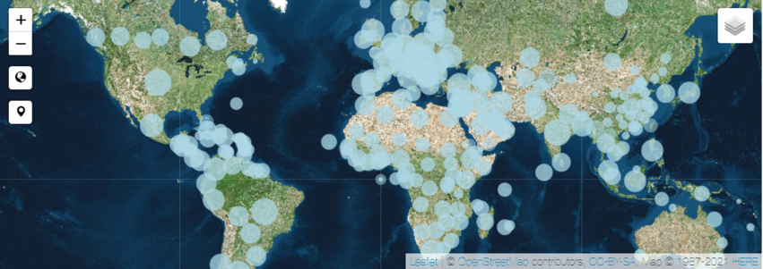
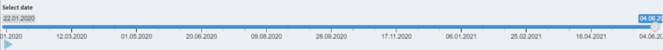
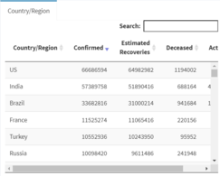

## Introduction

Problem Statement

> 1. How many people are being diagnosed as positive, died, or recovered from COVID-19 per day?
> 2. How did the confirmed, deceased and recovered cases evolve?
> 3. What are the specific cases by country per day?
> 4. How many countries were affected by COVID-19?

Data Acquisition

> 1. Data from John Hopkins University

Data Extraction, wrangling and analysis

> 1. Extract the data by downloading from John Hopkins University GitHub Page

> 2. Create variables such as data confirmed and data deceased and chain it with various functions

--- .class #id 

## Value Box

#### This answers the how many people are being diagnosed as positive, died, or recovered from COVID-19 per day question in the problem statement.

---

## Map

#### By using leaflet and the reactive slider, a bubble map based on timed-series data is plotted. This answers the question of how did the confirmed, deceased and recovered cases evolve.

---

## Table

#### By using data table and the reactive slider, a data table based on timed-series data by country is plotted. This answers the question of what are the specific cases by country per day.
 

 
###### Link to GitHub repo: https://github.com/xfinalangelx/COVID-19-Dashboard 
 
###### Link to shinyapps: https://xfinalangelx.shinyapps.io/COVID-19-Dashboard/ 
 
###### Link to Assignment Report Markdown: https://github.com/xfinalangelx/COVID-19-Dashboard/blob/master/AssignmentMarkDown.Rmd 
